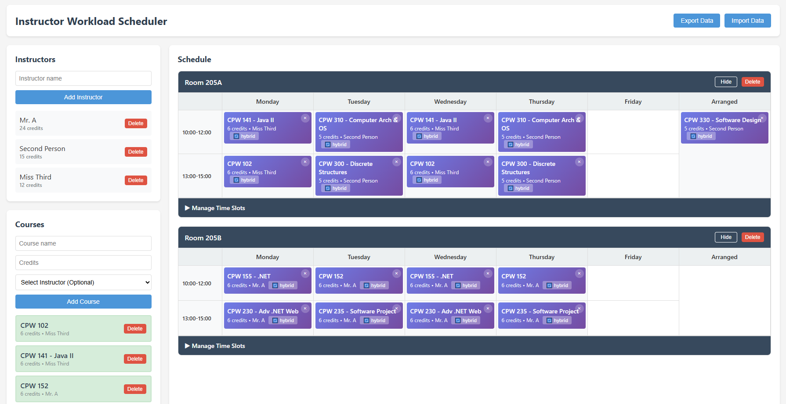

# Instructor Workload Scheduler

A front-end only web application for scheduling instructor workloads with drag-and-drop functionality. All data is stored in the browser's localStorage with import/export capabilities. Data Export/Import can be used to move data between different machines/browsers.

## Features

### Instructor Management
- Add instructors by name
- View total workload per instructor (in credits)
- Delete instructors (protected if they have assigned courses)

### Course Management
Courses should be treated as an instance of a section.
- Add courses with name, credits, and assigned instructor
- Edit course details by **double-clicking** on any scheduled course
- Delete courses (automatically removes from schedule)
- Drag courses to schedule slots

### Classroom Management
- Add classrooms by room number
- Show/hide individual classrooms
- Delete classrooms
- Per-day customizable timeslots

### Time Slot Management
- Add different timeslots for each day of the week
- Quick "Copy to All" button to replicate Monday's schedule across all weekdays
- Remove individual timeslots per day
- Flexible scheduling with different hours per day

### Schedule Grid
- Visual grid showing Monday-Friday schedule
- Drag and drop courses onto any available time slot
- **Courses can be assigned to multiple slots** (for classes that meet multiple times per week)
- Each scheduled slot shows:
  - Course name
  - Credits
  - Instructor name
  - Modality badge

### Modality Options
When dropping a course onto a schedule slot, choose from:
- 🏫 **In-Person** - Traditional classroom instruction
- 💻 **Online** - Virtual/remote instruction
- 🔄 **Hybrid** - Mix of in-person and online

### Data Management
- Automatic save to browser localStorage
- Export schedule as JSON file
- Import previously exported JSON files
- Backward compatible with older data formats

## Technical Details

- **100% Client-Side** - No server required
- **Local Storage** - Data persists in browser
- **Drag & Drop API** - Native HTML5 drag and drop
- **Responsive Design** - Works on various screen sizes
- **No Dependencies** - Pure HTML, CSS, and JavaScript

## Sample Data
Sample data is provided in the `docs/sample-data` directory and can be imported into either a locally running version or the GitHub Pages hosted version of the site.

## Screenshots
